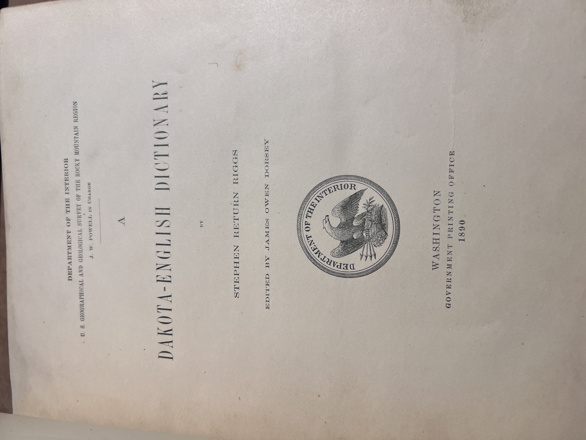

# Qwen2.5-VL

## Overview

An educational exploration of the Qwen2.5-VL model, focusing on understanding model cards, implementation details, and practical applications. This project combines academic research with hands-on implementation guides and integrates with multiple inference providers for comprehensive access to the model.

What shocks me about this model is the advanced capacity to process any data. I am going to use this to build and fine-tune a model on the Blackfeet Language as a use case using an old Dictionary from 1890. 



### Inference Providers Integration

This project provides comprehensive access to Qwen2.5-VL through multiple inference providers, each offering unique capabilities and advantages:

#### Hugging Face Inference Endpoints

- **Description**: Direct access to Qwen2.5-VL through Hugging Face's infrastructure

- **Key Features**:
  - Custom endpoint deployment
  - Optimized for production workloads
  - Scalable infrastructure

- **Setup**:

  ```python
  from huggingface_hub import InferenceClient
  client = InferenceClient(
      model="qwen/qwen2.5-vl",
      token="your_hf_token"
  )
  response = client.post(
      json={"inputs": "Analyze this image", "image": "<image_data>"}
  )
  ```

#### Hyperbolic Labs Integration

- **Description**: Specialized integration offering enhanced performance and additional features

- **Key Features**:
  - Advanced caching mechanisms
  - Custom optimization layers
  - Extended context handling
  - Real-time performance monitoring

- **Setup**:

  ```python
  from hyperbolic import HyperbolicClient
  client = HyperbolicClient(
      api_key="your_key",
      endpoint="your_endpoint"
  )
  response = client.process_multimodal(
      model="qwen2.5-vl",
      prompt="Analyze this image",
      image_data="<image_data>",
      optimization_level="high"
  )
  ```

#### Additional Provider Integrations

##### RunPod

- **Features**: 
  - GPU-optimized infrastructure
  - Pay-per-second pricing
  - Custom container support

- **Setup**:

  ```python
  import runpod
  runpod.api_key = "your_key"
  endpoint = runpod.Endpoint("qwen2.5-vl")
  ```

##### Together AI

- **Features**:
  - Low-latency inference
  - Fine-tuning capabilities
  - Extensive model selection

- **Setup**:

  ```python
  import together
  together.api_key = "your_key"
  together.Models.start("qwen2.5-vl")
  ```

##### Anyscale

- **Features**:
  - Distributed computing support
  - Auto-scaling capabilities
  - Enterprise-grade security

- **Setup**:

  ```python
  from anyscale import AnyscaleClient
  client = AnyscaleClient(api_key="your_key")
  ```

##### Replicate

- **Features**:
  - Containerized deployment
  - Version control for models
  - Webhook support

- **Setup**:

  ```python
  import replicate
  client = replicate.Client(api_token="your_token")
  ```

### Provider Selection Guide

Choose your provider based on your specific needs:

1. **Development & Testing**

   - Replicate: Good for experimentation

2. **Production Deployment**

   - Hugging Face: Robust infrastructure, good for stable deployments
   - Hyperbolic Labs: When performance is critical
   - Anyscale: For enterprise-scale applications

3. **Cost Optimization**

   - RunPod: Pay-per-second, good for sporadic usage
   - Together AI: Competitive pricing for high volume

4. **Special Requirements**

   - Custom deployments: Hugging Face or RunPod
   - High performance: Hyperbolic Labs
   - Enterprise security: Anyscale or Hugging Face

## Project Structure

### 1. Academic Foundation (`/academic`)

- **Paper Analysis**: Deep dive into the Qwen2.5-VL research paper

- **Key Innovations**:
  - Window attention in visual encoder
  - Dynamic FPS sampling
  - MRoPE temporal upgrades
  - Data curation insights (4.1T tokens)

- **Benchmark Results**: Comprehensive performance analysis across multiple domains

### 2. Model Understanding (`/model`)

- **Core Capabilities**:
  - Document parsing & OCR
  - Object grounding
  - Video understanding
  - Agent functionality

- **Architecture Analysis**:
  - Visual processing pipeline
  - Temporal understanding mechanisms
  - Spatial awareness systems
  - Integration capabilities

- **Performance Deep Dives**:
  - Visual grounding (RefCOCO, ODinW)
  - Video comprehension (Video-MME, LVBench)
  - Agent capabilities (ScreenSpot, AndroidWorld)

### 3. Implementation Guide (`/implementation`)

- **Model Cards**:
  - Structure and templates
  - Best practices
  - Validation methods

- **hyperbolic.xyz Integration**:
  - API setup guides
  - Authentication handling
  - Request/Response patterns
  - Error management

- **Example Applications**:
  - Document analysis
  - Video processing
  - GUI automation

### 4. Practical Tools (`/tools`)

- **Validation Suite**:
  - Model card validators
  - Performance benchmarking
  - Integration testing

- **Data Tools**:
  - Dictionary/PDF downloader with progress tracking
  - File validation and error handling
  - Automated data organization

- **Example Scripts**:
  - API interaction examples
  - Processing pipelines
  - Utility functions

### Using the Dictionary Downloader

```bash

# Download dictionary or PDF files with progress tracking

python tools/download_dictionary.py [URL]

# Example:

python tools/download_dictionary.py https://pubs.usgs.gov/unnumbered/70037986/report.pdf

```

The downloader features:

- Progress bar with download speed and ETA

- Automatic file naming from URL

- Error handling and validation

- Organized storage in data/sources

## Getting Started

### Prerequisites

- Python 3.8+

- Git

- API access to one or more providers:
  - Hugging Face API key
  - Hyperbolic AI API key
  - Additional provider API keys as needed

### Installation

```bash

# Clone the repository

git clone https://github.com/HarleyCoops/Qwen2.5VL.git
cd Qwen2.5VL

# Create and activate virtual environment

python -m venv venv
source venv/bin/activate  # On Windows: venv\Scripts\activate

# Install dependencies

pip install -r requirements.txt

# Set up environment variables

cp .env.template .env

# Edit .env with your API keys

```

## Connecting to Qwen2.5B via Hugging Face Credentials

Use the existing Hugging Face credentials to connect to Qwen2.5B:

```python
from transformers import pipeline
# use_auth_token flag leverages your existing Hugging Face credentials (set in your environment)
pipe = pipeline("image-text-to-text", model="qwen/qwen2.5B", use_auth_token=True)
messages = [{"role": "user", "content": "Who are you?"}]
print(pipe(messages))
```

## Multi-Provider Inference Connector

The project now includes a unified inference connector that allows access to multiple inference providers (Hugging Face, OpenRouter, and Hyperbolic). This connector reads API keys and endpoints from environment variables, and provides an easy interface to perform inference tasks.

### Usage Example

```python
from implementation.inference_connector import InferenceConnector

connector = InferenceConnector()
result = connector.infer('huggingface', 'Who are you?')
print(result)
```

### Providers

- **Hugging Face**: Uses the `transformers` package to perform image-text-to-text inference. Ensure the `HF_API_KEY` environment variable is set and the `transformers` package is installed.
- **OpenRouter**: For inference using OpenRouter. Set `OPENROUTER_API_KEY` and `OPENROUTER_ENDPOINT` in your environment.
- **Hyperbolic**: For inference using Hyperbolic. Set `HYPERBOLIC_API_KEY` and `HYPERBOLIC_ENDPOINT` in your environment.

### Environment Variables

Make sure to configure the following environment variables:

- HF_API_KEY
- OPENROUTER_API_KEY
- OPENROUTER_ENDPOINT
- HYPERBOLIC_API_KEY
- HYPERBOLIC_ENDPOINT

## Project Goals

1. **Educational Understanding**

   - Comprehensive breakdown of Qwen2.5-VL's architecture
   - Clear explanation of key innovations
   - Practical implementation guides
   - Integration patterns for multiple providers

2. **Technical Implementation**

   - Model card creation and validation
   - Multi-provider API integration
   - Practical application examples
   - Performance comparison across providers

3. **Best Practices**

   - Model card standards
   - API usage patterns
   - Performance optimization
   - Provider selection guidelines

4. **Future Development**

   - Integration with additional inference providers
   - Performance benchmarking across providers
   - Cost optimization strategies
   - Advanced use case implementations

## Integration Pipeline

This section outlines the step-by-step pipeline for integrating Qwen2.5-VL with various inference providers, ensuring robust, automated, and continuous deployment.

### 1. Environment Setup
- Install required client packages (e.g., via pip for Hyperbolic, Hugging Face, etc.).
- Configure environment variables (e.g., HYPERBOLIC_API_KEY, HYPERBOLIC_ENDPOINT, HF_API_KEY).

### 2. Connection Module Development
- Develop dedicated modules for each provider (e.g., hyperbolic_connection.py, openrouter_integration.py).
- Implement connection tests, detailed error handling, and logging to capture API responses and failures.

### 3. Testing and Verification
- Write test scripts to verify connectivity and proper API responses (refer to implementation/examples/ for examples).
- Integrate these tests in the CI/CD pipeline to automatically validate deployments.

### 4. Integration with Qwen2.5-VL Workflow
- Combine provider-specific modules under a unified interface to simplify inference requests.
- Abstract provider details so that switching backends requires minimal code changes.

### 5. CI/CD and Automated Monitoring
- Embed integration tests into GitHub Actions workflows to trigger on code push and pull requests.
- Monitor API performance and error tracking to ensure seamless inference service.
- Automate documentation updates and PR generation based on test outcomes.

### 6. Future Enhancements
- Expand support to additional providers as needed (e.g., Together AI, Anyscale, Replicate).
- Optimize performance, security, and cost management across providers.
- Continuously review and update documentation based on integration progress and user feedback.

## Automated Documentation & Development

### GitHub Actions Workflow

Our project uses GitHub Actions for automated documentation and development workflows:

#### Trigger Events

- Every 15 minutes (automated updates)

- On push to main branch

- On pull request to main branch

- Manual trigger (workflow_dispatch)

#### Automated Documentation

The system automatically:

- Updates documentation every 15 minutes

- Tracks learning progress in PROGRESS.md

- Validates model cards and documentation

- Creates PRs for documentation updates

- Deploys documentation site

- Notifies on any failures

#### Automated Tasks

1. **Documentation Coverage**

   - Frequency: Every push/PR
   - Tasks:
     - Python docstring validation
     - Documentation generation with pydoc
     - Markdown link checking
     - Documentation site building

2. **GitHub Copilot Integration**

   - Frequency: Every push/PR
   - Tasks:
     - Documentation improvement suggestions
     - Code documentation review
     - Automated documentation updates

3. **Model Card Validation**

   - Frequency: Every push/PR
   - Tasks:
     - Structure validation
     - Required sections check
     - Metrics verification
     - Placeholder detection

4. **Progress Tracking**

   - Frequency: Every push/PR
   - Tasks:
     - PROGRESS.md updates
     - Task completion tracking
     - Milestone documentation

5. **Quality Checks**

   - Frequency: Every push/PR
   - Tasks:
     - Markdown linting
     - Link validation
     - Documentation formatting

#### Automated Outputs

1. **Documentation PRs**

   - Auto-generated pull requests for documentation updates
   - Copilot-suggested improvements
   - Progress tracking updates

2. **Documentation Site**

   - Auto-deployed to GitHub Pages
   - Updated on main branch pushes
   - Includes latest documentation changes

3. **Failure Notifications**

   - Automatic issue creation on workflow failures
   - Detailed error reporting
   - Quick problem identification

## Setting Up Automated Learning Documentation

### 1. Initial Repository Configuration

#### GitHub Permissions Setup

1. **Enable Actions Write Permissions**:

   ```

   Repository Settings → Actions → Workflow permissions:
   1. Select "Read and write permissions"

   2. Check "Allow GitHub Actions to create and approve pull requests"

   3. Click "Save"

   ```

2. **Generate Access Token**:

   ```

   GitHub.com → Profile → Settings → Developer settings:
   1. Personal access tokens → Tokens (classic)

   2. Generate new token (classic)

   3. Name: "Documentation Automation Token"

   4. Set appropriate expiration

   5. Select required scopes:

      ✓ repo (all)
      ✓ workflow
      ✓ write:packages
      ✓ admin:org
      ✓ admin:repo_hook
      ✓ admin:org_hook
      ✓ copilot
   6. Generate and copy token

   ```

3. **Configure Repository Secrets**:

   ```

   Repository Settings → Secrets and variables → Actions:
   1. Click "New repository secret"

   2. Name: COPILOT_TOKEN

   3. Value: [Your generated token]

   4. Add secret

   ```

#### Required Configurations Checklist

- [ ] Actions write permissions enabled globally

- [ ] Token generated with all required scopes

- [ ] COPILOT_TOKEN secret configured

- [ ] Workflow permissions set in repository

- [ ] Documentation workflow file present

- [ ] Node.js setup included in workflow

### 2. Documentation Automation Features

#### Automated Learning Capture

- **Code Documentation**:
  - Automated docstring validation
  - Style consistency checks
  - Best practices enforcement

- **Progress Tracking**:
  - Automated PROGRESS.md updates
  - Milestone documentation
  - Learning journey capture

- **Knowledge Base**:
  - Automated documentation site
  - Cross-referenced learning notes
  - Searchable knowledge repository

#### Integration Points

- **GitHub Copilot**:
  - Real-time documentation suggestions
  - Code improvement recommendations
  - Learning pattern recognition

- **Automated Updates**:
  - PR creation for documentation
  - Progress tracking updates
  - Site deployment

### 3. Using the Automation

#### Daily Development Workflow

1. **Write Code with Learning Notes**:

   ```python
   def analyze_image(image_path: str) -> dict:
       """
       Analyze image using Qwen2.5-VL.
       
       Learning Notes:
       - Key Concept: Visual encoder with window attention
       - Understanding: How the model processes images
       - Reference: Paper section 2.1
       
       Implementation:
       - Uses window attention for efficiency
       - Handles multiple image formats
       - Returns structured analysis
       """
       # Implementation

   ```

2. **Commit with Learning Context**:

   ```bash
   git commit -m "Add image analysis function:
   
   Learning:
   - Implemented window attention concepts
   - Explored visual encoder architecture
   - Referenced paper section 2.1
   
   Technical:
   - Added type hints
   - Included comprehensive docstrings
   - Added learning notes"
   ```

3. **Review Automated Updates**:

   - Check Actions tab for workflow status
   - Review generated documentation PRs
   - Validate learning captures

#### Documentation Patterns

1. **Code Documentation**:

   - Include learning notes in docstrings
   - Reference source materials
   - Document understanding progress

2. **Progress Tracking**:

   - Use structured commit messages
   - Update PROGRESS.md regularly
   - Tag learning milestones

3. **Knowledge Sharing**:

   - Contribute to documentation site
   - Review and refine automated updates
   - Share learning insights

### 4. Troubleshooting Guide

#### Common Issues

1. **Permission Problems**:

   - Verify repository settings
   - Check token scopes
   - Confirm secret configuration

2. **Token Issues**:

   - Validate token expiration
   - Check scope coverage
   - Regenerate if needed

3. **Workflow Debugging**:

   - Enable debug logging
   - Check Actions tab logs
   - Verify step outputs

#### Quick Fixes

1. **Workflow Failures**:

   ```

   1. Check Actions tab error message

   2. Verify permissions in repository settings

   3. Confirm token validity

   4. Review workflow file configuration

   ```

2. **Documentation Updates**:

   ```

   1. Verify file paths in workflow

   2. Check markdown formatting

   3. Validate documentation structure

   4. Review PR creation permissions

   ```

### Development Workflow

1. **Local Development**

   - Run `pip install -r requirements.txt` for dependencies
   - Copy `.env.template` to `.env` and configure
   - Follow documentation standards in `.markdownlint.json`

2. **Contributing**

   - Create feature branch
   - Make changes
   - Push to trigger automated checks
   - Review automated suggestions
   - Submit PR for review

3. **Documentation**

   - Follow model card templates
   - Update PROGRESS.md
   - Add docstrings to code
   - Review automated suggestions

## Learning Process Automation

### GitHub Copilot Integration

- **Automated Code Documentation**
  - Real-time documentation suggestions
  - Context-aware code explanations
  - Best practices enforcement

- **Learning Workflow**
  1. Write initial code/comments

  2. Trigger Copilot suggestions (`Ctrl+Enter` on code blocks)

  3. Review and refine documentation

  4. Commit with detailed explanations

- **Documentation Patterns**

  ```python
  # Example of documentation pattern:

  def process_image(image_data):
      """
      Process image using Qwen2.5-VL model.
      
      Learning Notes:
      - Understanding: How the model processes visual input
      - Key Concept: Window attention in visual encoder
      - Reference: Section 2.1 of paper
      
      Implementation Details:
      - Uses window attention for efficient processing
      - Handles multiple image formats
      - Integrates with OpenRouter API
      
      Args:
          image_data: Raw image data or path to image file
          
      Returns:
          dict: Processed results including analysis and metadata
      """
      pass
  ```

### Automated Updates

- **Daily Documentation Summaries**
  - Automated PR creation with documentation improvements
  - Learning progress tracking in PROGRESS.md
  - Knowledge base updates based on code changes

- **Integration with GitHub Actions**
  - Automated documentation checks
  - Code quality verification
  - Learning progress visualization

## GitHub Secrets Configuration

### Required Secrets

1. **COPILOT_TOKEN**

   - Purpose: Enable automated documentation suggestions
   - Scope: Repository-level
   - Permission: Copilot access
   - Usage: Powers automated documentation improvements

2. **GITHUB_TOKEN**

   - Purpose: Workflow automation
   - Scope: Automatically provided by GitHub Actions
   - Permission: Workflow operations
   - Usage: Repository operations and PR creation

### Setup Instructions

1. **Generate Personal Access Token**:

   - Visit GitHub Settings → Developer Settings
   - Select Personal Access Tokens → Tokens (classic)
   - Enable required scopes:
     - `copilot` (for documentation suggestions)
     - `workflow` (for GitHub Actions)
     - `repo` (for repository access)
   - Copy the generated token

2. **Add Repository Secrets**:

   - Navigate to: Repository → Settings → Secrets and Variables → Actions
   - Click "New repository secret"
   - Add secrets:

     ```

     Name: COPILOT_TOKEN
     Value: [your generated token]
     ```

3. **Verify Configuration**:

   - Check Actions tab for workflow status
   - Confirm Copilot suggestions in PRs
   - Monitor documentation updates
   - Review automated commits

### Workflow Timing and Monitoring

#### Automatic Triggers

The documentation automation workflow runs:

1. **On Every Push to Main**:

   - Immediate trigger when code is pushed
   - Full documentation cycle (~5-10 minutes)
   - Creates PR with updates if needed

2. **On Pull Requests**:

   - Triggers when PR is opened/updated
   - Validates documentation
   - Suggests improvements

3. **Manual Trigger**:

   - Available through Actions tab
   - Can be run on-demand
   - Useful for forcing documentation updates

#### Monitoring Progress

1. **Immediate Feedback**:

   - Check GitHub Actions tab after push
   - Look for green checkmark (✓) or red cross (×)
   - Initial status within 1-2 minutes

2. **Documentation PRs**:

   - Created automatically if changes needed
   - Usually appear 5-10 minutes after push
   - Tagged with "documentation" label

3. **Notification Points**:

   - GitHub notification on workflow completion
   - Email on workflow failure
   - PR creation notification
   - Issue creation for failures

4. **Success Indicators**:

   - Green checkmark in Actions tab
   - Documentation PR created (if needed)
   - Updated documentation site
   - No failure notifications

### Troubleshooting

1. **Workflow Failures**:

   - Check Actions tab for error messages
   - Verify secret accessibility
   - Confirm workflow permissions

2. **Copilot Integration Issues**:

   - Verify token has correct scopes
   - Check token expiration
   - Review workflow logs

3. **Documentation Updates**:

   - Confirm branch permissions
   - Check PR creation permissions
   - Verify markdown formatting

## Contributing

## License

MIT License

## Acknowledgments

- Original Qwen2.5-VL research team

- OpenRouter platform

- Community contributors

## Project Progress
For a detailed list of modules and their implementation status, please refer to [PROGRESS.md](./PROGRESS.md) and `instructions.txt` for setup and usage guidance.
